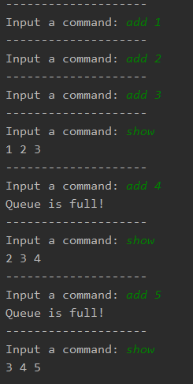

Назаров Сергей ИБ-119
# Лабораторная работа 1.
## Очередь с ограниченным размером.

Очередь реализована с помощью связанного списка. Размер очереди выставляется во время её инициализации. Если происходит переполнение очереди, то ссылка на первый элемент пропадает, а новый элемент добавляется в конец.
ClientTestLinkedQueue - класс, использующий интерфейс командной строки для добавления элементов в очередь (команда add) и отображение элементов, находящихся в очереди (команда show).

Образец выполнения программы c очередью в 3 элемента:

